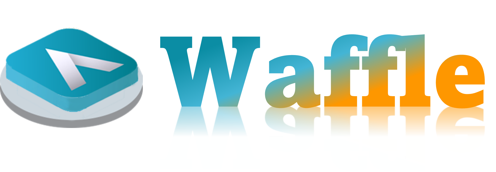
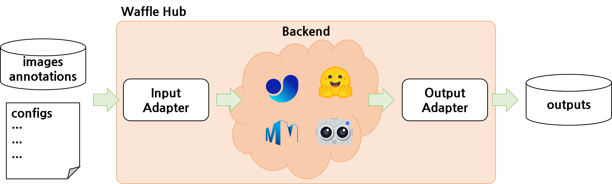
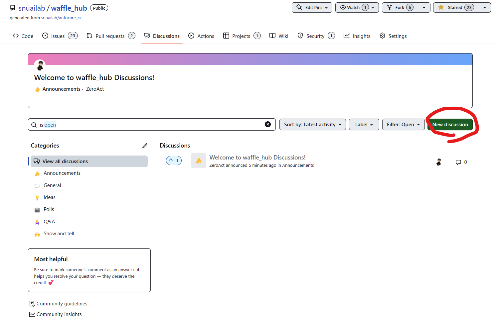

  

    
  

# Introduction

The user interface has evolved dramatically over the years, bringing us incredible benefits in terms of time efficiency. For instance, in the past, we had to manually dial a number to call someone with an old phone. But now, with buttons, touch screens and even voice commands, we can make calls in a matter of seconds.

In many machine learning projects, we face the challenge of comparing different models, datasets and frameworks. This can be very tedious😒 and time-consuming⏳. Because each dataset has its own format, each framework has its own configuration and each model has its own input and output even they are dealing with the exact same task 😠.

When it comes to MLOps (machine learning operations), you need to be able to keep up with all the new ideas and SOTA models in deep learning as quickly as possible🚀.

Here comes Waffle🧇. Waffle is a framework that lets you use lots of different deep learning tools through just one interface. It's user-friendly and easy😊. We believe it's going to make a big revolution in the AI industry.

Experience the power💪 of revolution that Waffle🧇 brings to you, unlocking limitless possibilities for your machine learning projects.

# Discussion

If you want to discuss about waffle or request new features, please use [our discussion page](https://github.com/snuailab/waffle_hub/discussions)

